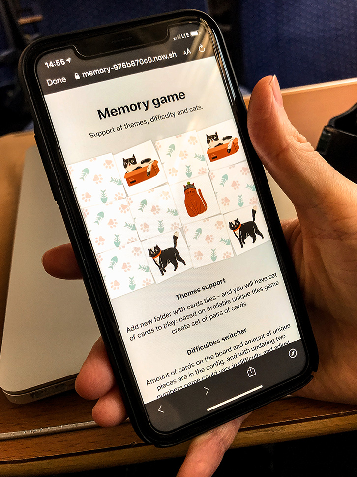

# Memory game

Click on cards, match pairs, check memory.

Implemented with React and Styled-components to support theming. Board size and amount of unique cards available to match configurable and derived from theme. Theme is a set of colors, covers and cards images.

